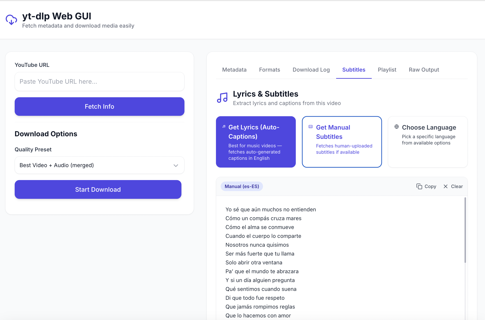
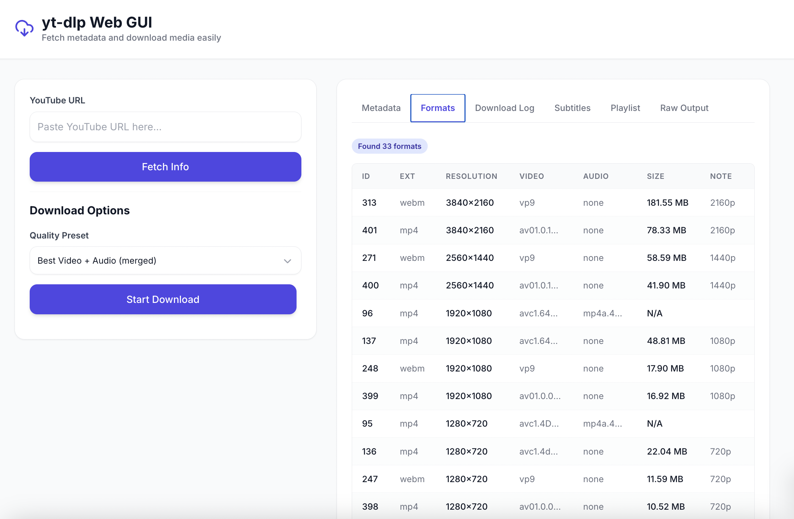
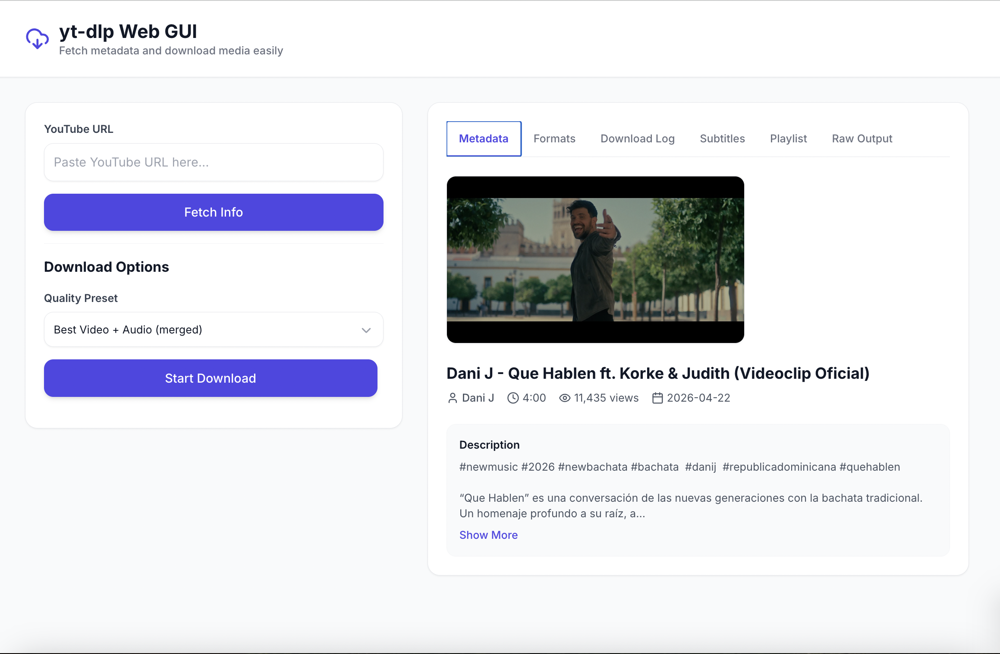
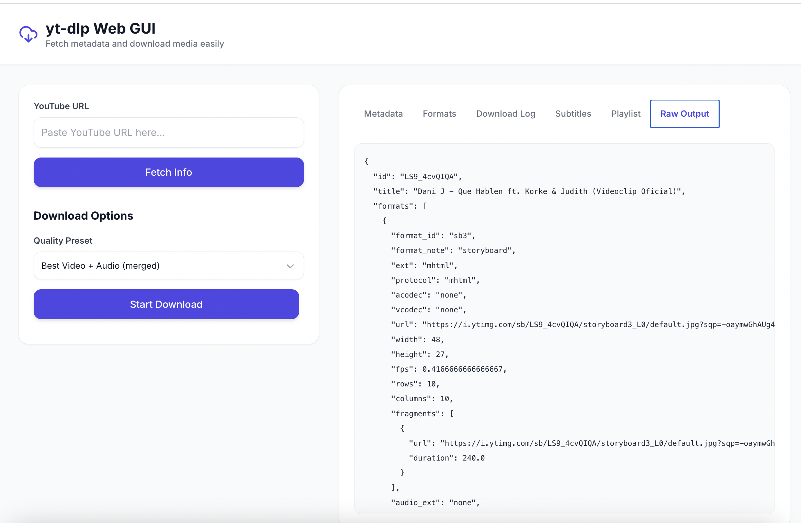

# yt-dlp Web GUI (by Reflex)

 by Python Reflex
> Important: Before working on this project, read [AGENTS.md](AGENTS.md) for required workflows and tooling expectations.

## Usage Guide

The app is split into two areas: the left panel handles fetching and download controls, while the right panel shows metadata, formats, subtitles, playlist entries, logs, and raw yt-dlp output.

### 1. Fetch a video or playlist
Paste a YouTube URL into the left panel and click **Fetch Info**. Once the request completes, the right panel opens on the Metadata tab.



### 2. Review the fetched information
Use the tabs on the right to switch between:

- Metadata: thumbnail, title, channel, duration, view count, upload date, and description.
- Formats: the available format IDs, codecs, resolutions, and file sizes.
- Download Log: live yt-dlp output while a download is running.
- Subtitles: lyric and caption tools, language selection, and fetched subtitle text.
- Playlist: playlist entries and playlist range controls when the URL is a playlist.
- Raw Output: the raw JSON returned by yt-dlp.





### 3. Choose a download preset
Select a preset in the left panel. Use **Custom Format ID** if you want to enter an advanced yt-dlp format expression such as `137+140`.

### 4. Configure subtitle options
Expand **Advanced Download Options** to include manual subtitles, auto-generated subtitles, subtitle languages, and the subtitle output format.

### 5. Start or cancel the download
Click **Start Download** to begin. The progress bar, speed, ETA, file size, and command log update while the job is running. Use **Cancel Download** to stop an active download.

### 6. Download a playlist range
If the URL is a playlist, open the Playlist tab. Set the start and end index, then click **Download Range**. Set **End Index** to `0` to download the full playlist.

## Documentation

The GUI walkthrough screenshots are stored in [docs/images](docs/images). The main app entry point is [youtube_downloader_gui/youtube_downloader_gui.py](youtube_downloader_gui/youtube_downloader_gui.py), and the left and right panel components live under [youtube_downloader_gui/components](youtube_downloader_gui/components).

## Getting Started

> Before making changes, read the project guidelines in [AGENTS.md](AGENTS.md).

This project is managed with [Poetry](https://python-poetry.org/).

### Prerequisites

Based on this project's dependencies, install the following system-level packages first via Homebrew (macOS):

```bash
brew install python@3.11  poetry
```

| Package | Reason |
|---------|--------|
| `python@3.11` | The project requires Python ~3.11 as specified in `pyproject.toml` |
| `poetry` | Python dependency manager used to manage this project |

After installing Playwright (via `poetry install`), you also need to download browser binaries:

```bash
poetry run playwright install
```


### Installation

1. (Recommended) Configure Poetry to store the virtual environment inside the project directory. This makes it easier for IDEs and AI agents to discover and analyze dependency source code:

```bash
poetry config virtualenvs.in-project true
```

> This is a global one-time setting. After this, every project will create its `.venv/` under the project root instead of a shared cache folder (`~/Library/Caches/pypoetry/virtualenvs/`). The `.venv/` directory is already in `.gitignore`.

2. Ensure Poetry uses Python 3.11:

```bash
poetry env use python3.11
poetry env info
```

3. Install dependencies:

```bash
poetry install
```

### Running the App

Start the development server:

```bash
poetry run ./reflex_rerun.sh
```

The application will be available at `http://localhost:3000`.

### Clean Rebuild & Run

To fully clean the environment, reinstall all dependencies, and start the app in one step:

```bash
./proj_reinstall.sh --with-rerun
```

This will remove existing Poetry virtual environments and Reflex artifacts, recreate the environment from scratch, and automatically launch the app afterwards.

---
